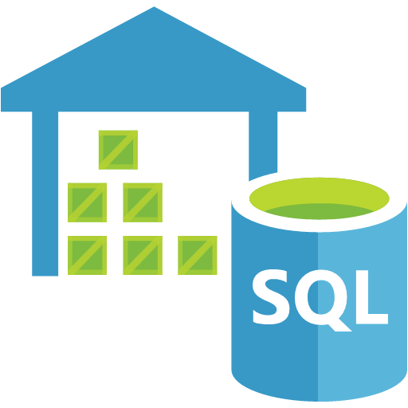

#  🛢️ GlobalStoreDW: SQL Data warehouse Project  


## 📌 Project Overview
This project demonstrates end-to-end data warehouse modeling using **SQL Server database lifecycle** and **VS Code**, version control, and automated **CI/CD pipelines**. It implements a star schema data warehouse designed for sales data analysis.

## 🛠 Tech Stack
*   **SQL Server**: Target data warehouse.
*   **VS Code**: Development environment with the **SQL Database Projects** extension.
*   **GitHub Actions**: Automation for CI/CD.
*   **.NET SDK & SQLPackage**: Tools for building and deploying `.dacpac` files.

---

## 🚀 Step-by-Step Implementation

### Data Identification, Staging, and Transformation Steps
The process begins with raw sales data containing ~25 headers such as Row ID, Order ID, Customer ID, Sales, Profit, etc.

1. **Staging**
2. **Star Schema Data Modeling**
3. **Schema-as-Code Development**
4. **Data Transformation & Loading**
5. **Build and Deployment Lifecycle**
6. **Data Validation & Quality Checks**
7. **CI/CD Automation**
8. **Key Benefits**
9. **License**


### 1. Staging  🎬
 Upload the raw CSV data into a staging table within MS SQL Server to prepare for transformation.

### 2. Star Schema Data Modeling  🌟
Design the star schema by separating the staged data into specialized dimension and fact tables.


*   **👤 dimCustomer**: Customer ID (PK), CustomerName, Segment.
      ```sql
         CREATE TABLE [dbo].[dimCustomer] (
         [CustomerID]   VARCHAR (50)  NOT NULL,
         [CustomerName] VARCHAR (255) NOT NULL,
         [Segment]      VARCHAR (100) NULL,
         CONSTRAINT [PK_dimCustomer] PRIMARY KEY CLUSTERED ([CustomerID] ASC)
      );
      GO
      ```
*   **dimProduct**: Product ID (PK), Product Name, Category, Sub-Category.
      ```sql
         CREATE TABLE [dbo].[dimProduct] (
         [ProductID]   VARCHAR (50)  NOT NULL,
         [ProductName] VARCHAR (255) NOT NULL,
         [Category]    VARCHAR (100) NOT NULL,
         [SubCategory] VARCHAR (100) NULL,
         CONSTRAINT [PK_dimProduct] PRIMARY KEY CLUSTERED ([ProductID] ASC)
      );
      GO
      ```
*   **dimLocation**: Postal Code (PK), City, State, Country, Region, Market.
      ```sql
         CREATE TABLE [dbo].[dimLocation] (
         [PostalCode] VARCHAR (20)  NOT NULL,
         [City]       VARCHAR (100) NOT NULL,
         [State]      VARCHAR (100) NOT NULL,
         [Country]    VARCHAR (100) NOT NULL,
         [Region]     VARCHAR (100) NULL,
         [Market]     VARCHAR (100) NULL,
         CONSTRAINT [PK_dimLocation] PRIMARY KEY CLUSTERED ([PostalCode] ASC)
      );
      GO
      ```
         

*   **FactOrders**: RowID (PK), and foreign keys linking to the dimensions, along with measures like Sales, Quantity, and Discount.

      ```sql
      CREATE TABLE [dbo].[FactOrders] (
         [RowID]         INT             NOT NULL,
         [OrderID]       VARCHAR (50)    NOT NULL,
         [CustomerID]    VARCHAR (50)    NOT NULL,
         [PostalCode]    VARCHAR (20)    NOT NULL,
         [ProductID]     VARCHAR (50)    NOT NULL,
         [OrderDate]     DATE            NOT NULL,
         [ShipDate]      DATE            NULL,
         [ShipMode]      VARCHAR (50)    NULL,
         [OrderPriority] VARCHAR (20)    NULL,
         [PaymentMode]   VARCHAR (50)    NULL,
         [Sales]         DECIMAL (18, 2) NOT NULL,
         [Quantity]      INT             NOT NULL,
         [Discount]      DECIMAL (5, 2)  NOT NULL,
         [Profit]        DECIMAL (18, 2) NOT NULL,
         [ShippingCost]  DECIMAL (18, 2) NOT NULL,
         CONSTRAINT [PK_FactOrders] PRIMARY KEY CLUSTERED ([RowID] ASC),
         CONSTRAINT [FK_FactOrders_Customer] FOREIGN KEY ([CustomerID]) REFERENCES [dbo].[dimCustomer] ([CustomerID]),
         CONSTRAINT [FK_FactOrders_Location] FOREIGN KEY ([PostalCode]) REFERENCES [dbo].[dimLocation] ([PostalCode]),
         CONSTRAINT [FK_FactOrders_Product] FOREIGN KEY ([ProductID]) REFERENCES [dbo].[dimProduct] ([ProductID]),
         INDEX [IX_FactOrders_OrderDate] NONCLUSTERED ([OrderDate]),
         INDEX [IX_FactOrders_CustomerID] NONCLUSTERED ([CustomerID]),
         INDEX [IX_FactOrders_ProductID] NONCLUSTERED ([ProductID]),
         INDEX [IX_FactOrders_PostalCode] NONCLUSTERED ([PostalCode])
      );
      GO
      ```

### 3. Schema-as-Code Development  { }
Organize the database objects within the repository using the following structure:
*   `\dbo\Tables\`: Contains `.sql` files for the Star Schema tables.
*   `\Seed_Data_Scripts\`: Utility scripts for data loading (`SeedData.sql`).
*   `\GlobalStoreDW.sqlproj`: The project definition file for building the database.

### 4. Data Transformation & Loading  📥
Develop scripts to move data from the staging area into the finalized star schema model.
*   **Normalization**: Ensure data is properly structured and duplicates are removed during the transfer.
*   **Constraints**: Apply **Primary Keys** and **Foreign Keys** to maintain referential integrity between `FactOrders` and the dimension tables.
*   **PostDeployment.sql**: In an SDK-style workflow, after table and object creation, sample or initial data needs to be transferred. One constraint is that you can have only one PostDeployment script. A solution is to create multiple `.sql` files and call them from that script, as shown below.

      ```sql
      -- PostDeployment.sql This file contains SQL statements that will be executed after the build script. 
      :r .\Seed_Data_Scripts\StagingSeed.sql
      :r .\Seed_Data_Scripts\CustomerInsert.sql
      :r .\Seed_Data_Scripts\ProductInsert.sql
      :r .\Seed_Data_Scripts\LocationInsert.sql
      :r .\Seed_Data_Scripts\FactOrdersInsert.sql
      ```


```sql
 📥 Staging data Load

SET DATEFORMAT dmy;
GO

BULK INSERT [dbo].[Stag_Orders]
FROM 'd:\Home\Tejas\OneDrive\Projects\SQL-Data-Warehouse-Project\GlobalStoreDW\Seed_data\Data\global_superstore_2016.csv'
WITH (
    FORMAT = 'CSV',
    FIRSTROW = 2,
    FIELDTERMINATOR = ',',
    ROWTERMINATOR = '\n' -- This handles standard web/linux line breaks (\n) safely
);
```

```sql
-- 1. Populate dimCustomer Safely  
      INSERT INTO dbo.dimCustomer (CustomerID, CustomerName, Segment)
      SELECT 
         [Customer ID], 
         MAX([Customer Name]) AS CustomerName, -- Handles edge cases of conflicting names for one ID
         MAX([Segment])       AS Segment
      FROM dbo.Stag_Orders
      WHERE [Customer ID] IS NOT NULL
      GROUP BY [Customer ID];

-- 2. Populate dimProduct Safely
      INSERT INTO dbo.dimProduct (ProductID, ProductName, Category, SubCategory)
      SELECT 
         [Product ID], 
         MAX([Product Name]) AS ProductName, -- Ensures a single unique row per ProductID
         MAX([Category])     AS Category,
         MAX([Sub-Category]) AS SubCategory
      FROM dbo.Stag_Orders
      WHERE [Product ID] IS NOT NULL
      GROUP BY [Product ID];

-- 3. Populate dimLocation Safely
      INSERT INTO dbo.dimLocation (PostalCode, City, State, Country, Region, Market)
      SELECT 
         [Postal Code], 
         MAX([City])    AS City, -- Collects the primary attributes for each distinct PostalCode
         MAX([State])   AS State,
         MAX([Country]) AS Country,
         MAX([Region])  AS Region,
         MAX([Market])  AS Market
      FROM dbo.Stag_Orders
      WHERE [Postal Code] IS NOT NULL
      GROUP BY [Postal Code];


-- 4. Finally, populate FactOrders Safely
      INSERT INTO dbo.FactOrders ( 
         RowID, OrderID, CustomerID, PostalCode, ProductID, 
         OrderDate, ShipDate, ShipMode, OrderPriority, PaymentMode, 
         Sales, Quantity, Discount, Profit, ShippingCost 
      )
      SELECT 
         CAST([Row ID] AS INT),
         [Order ID],
         [Customer ID],    
         [Postal Code],    
         [Product ID],     
         TRY_CAST([Order Date] AS DATE),
         TRY_CAST([Ship Date] AS DATE),
         [Ship Mode],
         [Order Priority],
         [Payment Mode],
         CAST([Sales] AS DECIMAL(18,2)),
         CAST([Quantity] AS INT),
         CAST([Discount] AS DECIMAL(5,2)),
         CAST([Profit] AS DECIMAL(18,2)),
         CAST([Shipping Cost] AS DECIMAL(18,2))   
      FROM dbo.Stag_Orders
      WHERE [Row ID] IS NOT NULL;      
```


### 5. Build and Deployment Lifecycle 🚀
Follow the Data warehouse development DevOps workflow to manage changes:
1.  **Define Schema**: Add or update `.sql` files for tables and procedures.
2.  **Version Control**: Commit changes to Git and use feature branches for new developments.
3.  **Build**: Compile the SQL project into a deployment-ready `.dacpac` file.
4.  **Deploy**: Publish the `.dacpac` to the target SQL Server environment.
5.  **Populate**: Execute the data load scripts to move data from staging to the production schema.


### 6. **Data Validation & Quality Checks**  ✅🧐
The file Validation.sql contains a set of SQL scripts used to validate data completeness, integrity and basic quality after ETL loads. The scripts are organized and documented so they can be run individually during development, CI checks, or after deployment. Key checks included:

- Row counts: compares total row counts between staging (dbo.Stag_Orders) and the production fact table (dbo.FactOrders) to ensure expected volumes were loaded.
- Distinct counts and key presence: verifies distinct customer and product counts in staging versus production, and checks for missing or NULL business keys.
- Date and range validations: ensures OrderDate and ShipDate are valid dates, that ShipDate >= OrderDate, and that dates fall within expected business ranges.
- Numeric field sanity checks: validates numeric fields (Sales, Quantity, Discount, Profit, ShippingCost) for non-nullness where required, reasonable ranges, and detects negative or outlier values.
- Referential integrity checks: validates that foreign keys (CustomerID, ProductID, PostalCode) referenced in FactOrders exist in their respective dimension/staging sources or flags orphaned rows.
- Duplicate detection: detects duplicate business keys (e.g., same OrderID and ProductID) and reports counts and sample offending rows.
- Sample data and quick spot checks: returns configurable sample rows from staging and fact tables for manual inspection, and summary aggregations by key dimensions (e.g., Sales by PostalCode, ShipMode).

Each script outputs clear result sets with descriptive column names so they can be asserted in automated tests or logged in CI pipelines. To run all checks locally, execute Validation.sql against the target database; in CI the same file is executed as part of the validation step after deployment.

For examples of the actual SQL statements used in each script, see the Validation.sql file in the repository (it includes the full SELECTs, JOINs and WHERE clauses referenced above).

```sql
-- Script 1
SELECT
    'Staging Total Rows' AS TableName,
    COUNT(*) AS RecordCount
FROM dbo.Stag_Orders
UNION ALL
SELECT
    'FactOrders Total Rows' AS TableName,
    COUNT(*) AS RecordCount
FROM dbo.FactO.....................(full code in Validation.sql file)


-- Script 2
SELECT
    (SELECT COUNT(DISTINCT [Customer ID])
     FROM dbo.Stag_Orders

     WHERE [Customer ID] IS NOT NULL) AS DistinctStagingCustomers,
    (SELECT COUNT(*).....................(full code in Validation.sql file)

```

### 7. CI/CD Automation  ⚙️
The project utilizes **GitHub Actions** (`.github/workflows/sql-deploy.yml`) to automate the lifecycle on every push.
*   Automatically restores NuGet packages and builds the `.sqlproj`.
*   Publishes the updated schema to the SQL Server using **sqlpackage**.
*   Performs database validation and unit checks before deployment.

---

## 8. 📈 Key Benefits  🗝️
*   **Audit Trail**: Every schema change is logged via Git commits.
*   **Collaboration**: Supports branching, merging, and peer reviews just like application code.
*   **Consistency**: Automation ensures that the star schema is deployed identically across development and production environments.

## 9. 📜 License  🪪
This project is licensed under the MIT License.
