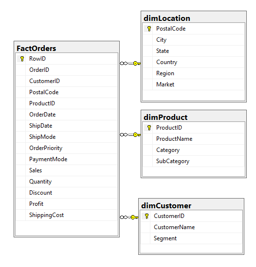

#  GlobalStoreDW: SQL Data warehouse Project  


## 📌 Project Overview
This project demonstrates an end-to-end Data warehouse modeling using **SQL Server database lifecycle** and **VS Code**, version control, and automated **CI/CD pipelines**. It implements a star schema data warehouse designed for sales data analysis.

## 🛠 Tech Stack
*   **SQL Server**: Target data warehouse.
*   **VS Code**: Development environment with the **SQL Database Projects** extension.
*   **GitHub Actions**: Automation for CI/CD.
*   **.NET SDK & SQLPackage**: Tools for building and deploying `.dacpac` files.

---

## 🚀 Step-by-Step Implementation

###  Data Identification, Staging and Transformation steps
The process begins with raw sales data containing ~25 headers such as Row ID, Order ID, Customer ID, Sales, Profit etc.

1. **Staging**
2. **Star Schema Data Modeling**
3. **Schema-as-Code Development**
4. **Data Transformation & Loading**
5. **Data Validation & Quality Checks**
6. **Performance Optimization**
7. **Documentation & Governance**
8. **Deployment & Monitoring**


### 1. Staging
 Upload the raw CSV data into a staging table within MS SQL Server to prepare for transformation.

### 2. Star Schema Data Modeling
Design the star schema by separating the staged data into specialized dimension and fact tables.



*   **👤 dimCustomer**: Customer ID (PK), CustomerName, Segment.
      ```sql
         CREATE TABLE [dbo].[dimCustomer] (
         [CustomerID]   VARCHAR (50)  NOT NULL,
         [CustomerName] VARCHAR (255) NOT NULL,
         [Segment]      VARCHAR (100) NULL,
         CONSTRAINT [PK_dimCustomer] PRIMARY KEY CLUSTERED ([CustomerID] ASC)
      );
      GO
      ```
*   **dimProduct**: Product ID (PK), Product Name, Category, Sub-Category.
      ```sql
         CREATE TABLE [dbo].[dimProduct] (
         [ProductID]   VARCHAR (50)  NOT NULL,
         [ProductName] VARCHAR (255) NOT NULL,
         [Category]    VARCHAR (100) NOT NULL,
         [SubCategory] VARCHAR (100) NULL,
         CONSTRAINT [PK_dimProduct] PRIMARY KEY CLUSTERED ([ProductID] ASC)
      );
      GO
      ```
*   **dimLocation**: Postal Code (PK), City, State, Country, Region, Market.
      ```sql
         CREATE TABLE [dbo].[dimLocation] (
         [PostalCode] VARCHAR (20)  NOT NULL,
         [City]       VARCHAR (100) NOT NULL,
         [State]      VARCHAR (100) NOT NULL,
         [Country]    VARCHAR (100) NOT NULL,
         [Region]     VARCHAR (100) NULL,
         [Market]     VARCHAR (100) NULL,
         CONSTRAINT [PK_dimLocation] PRIMARY KEY CLUSTERED ([PostalCode] ASC)
      );
      GO
      ```
         

*   **FactOrders**: RowID (PK), and foreign keys linking to the dimensions, along with measures like Sales, Quantity, and Discount.

      ```sql
      CREATE TABLE [dbo].[FactOrders] (
         [RowID]         INT             NOT NULL,
         [OrderID]       VARCHAR (50)    NOT NULL,
         [CustomerID]    VARCHAR (50)    NOT NULL,
         [PostalCode]    VARCHAR (20)    NOT NULL,
         [ProductID]     VARCHAR (50)    NOT NULL,
         [OrderDate]     DATE            NOT NULL,
         [ShipDate]      DATE            NULL,
         [ShipMode]      VARCHAR (50)    NULL,
         [OrderPriority] VARCHAR (20)    NULL,
         [PaymentMode]   VARCHAR (50)    NULL,
         [Sales]         DECIMAL (18, 2) NOT NULL,
         [Quantity]      INT             NOT NULL,
         [Discount]      DECIMAL (5, 2)  NOT NULL,
         [Profit]        DECIMAL (18, 2) NOT NULL,
         [ShippingCost]  DECIMAL (18, 2) NOT NULL,
         CONSTRAINT [PK_FactOrders] PRIMARY KEY CLUSTERED ([RowID] ASC),
         CONSTRAINT [FK_FactOrders_Customer] FOREIGN KEY ([CustomerID]) REFERENCES [dbo].[dimCustomer] ([CustomerID]),
         CONSTRAINT [FK_FactOrders_Location] FOREIGN KEY ([PostalCode]) REFERENCES [dbo].[dimLocation] ([PostalCode]),
         CONSTRAINT [FK_FactOrders_Product] FOREIGN KEY ([ProductID]) REFERENCES [dbo].[dimProduct] ([ProductID]),
         INDEX [IX_FactOrders_OrderDate] NONCLUSTERED ([OrderDate]),
         INDEX [IX_FactOrders_CustomerID] NONCLUSTERED ([CustomerID]),
         INDEX [IX_FactOrders_ProductID] NONCLUSTERED ([ProductID]),
         INDEX [IX_FactOrders_PostalCode] NONCLUSTERED ([PostalCode])
      );
      GO
      ```

### 3. Schema-as-Code Development
Organize the database objects within the repository using the following structure:
*   `\dbo\Tables\`: Contains `.sql` files for the Star Schema tables.
*   `\Seed_Data_Scripts\`: Utility scripts for data loading (`SeedData.sql`).
*   `\GlobalStoreDW.sqlproj`: The project definition file for building the database.

### 4. Data Transformation & Loading 
Develop scripts to move data from the staging area into the finalized star schema model.
*   **Normalization**: Ensure data is properly structured and duplicates are removed during the transfer.
*   **Constraints**: Apply **Primary Keys** and **Foreign Keys** to maintain referential integrity between `FactOrders` and the dimension tables.
*   **PostDeployment.sql**: In a SDK style (or DevOps) workflow after table (object) creation sample/initial data needs to be transferred. A constraint which restricts us to do this is we can have only one PostDeployment script. A solution for this proble is we can create multiple .sql files and call those from these file as below.

      ```sql
      -- PostDeployment.sql This file contains SQL statements that will be executed after the build script. 
      :r .\Seed_Data_Scripts\StagingSeed.sql
      :r .\Seed_Data_Scripts\CustomerInsert.sql
      :r .\Seed_Data_Scripts\ProductInsert.sql
      :r .\Seed_Data_Scripts\LocationInsert.sql
      :r .\Seed_Data_Scripts\FactOrdersInsert.sql
      ```


```sql
 📥 Staging data Load

SET DATEFORMAT dmy;
GO

BULK INSERT [dbo].[Stag_Orders]
FROM 'd:\Home\Tejas\OneDrive\Projects\SQL-Data-Warehouse-Project\GlobalStoreDW\Seed_data\Data\global_superstore_2016.csv'
WITH (
    FORMAT = 'CSV',
    FIRSTROW = 2,
    FIELDTERMINATOR = ',',
    ROWTERMINATOR = '\n' -- This handles standard web/linux line breaks (\n) safely
);
```

```sql
-- 1. Populate dimCustomer Safely  
      INSERT INTO dbo.dimCustomer (CustomerID, CustomerName, Segment)
      SELECT 
         [Customer ID], 
         MAX([Customer Name]) AS CustomerName, -- Handles edge cases of conflicting names for one ID
         MAX([Segment])       AS Segment
      FROM dbo.Stag_Orders
      WHERE [Customer ID] IS NOT NULL
      GROUP BY [Customer ID];

-- 2. Populate dimProduct Safely
      INSERT INTO dbo.dimProduct (ProductID, ProductName, Category, SubCategory)
      SELECT 
         [Product ID], 
         MAX([Product Name]) AS ProductName, -- Ensures a single unique row per ProductID
         MAX([Category])     AS Category,
         MAX([Sub-Category]) AS SubCategory
      FROM dbo.Stag_Orders
      WHERE [Product ID] IS NOT NULL
      GROUP BY [Product ID];

-- 3. Populate dimLocation Safely
      INSERT INTO dbo.dimLocation (PostalCode, City, State, Country, Region, Market)
      SELECT 
         [Postal Code], 
         MAX([City])    AS City, -- Collects the primary attributes for each distinct PostalCode
         MAX([State])   AS State,
         MAX([Country]) AS Country,
         MAX([Region])  AS Region,
         MAX([Market])  AS Market
      FROM dbo.Stag_Orders
      WHERE [Postal Code] IS NOT NULL
      GROUP BY [Postal Code];


-- 4. Finally, populate FactOrders Safely
      INSERT INTO dbo.FactOrders ( 
         RowID, OrderID, CustomerID, PostalCode, ProductID, 
         OrderDate, ShipDate, ShipMode, OrderPriority, PaymentMode, 
         Sales, Quantity, Discount, Profit, ShippingCost 
      )
      SELECT 
         CAST([Row ID] AS INT),
         [Order ID],
         [Customer ID],    
         [Postal Code],    
         [Product ID],     
         TRY_CAST([Order Date] AS DATE),
         TRY_CAST([Ship Date] AS DATE),
         [Ship Mode],
         [Order Priority],
         [Payment Mode],
         CAST([Sales] AS DECIMAL(18,2)),
         CAST([Quantity] AS INT),
         CAST([Discount] AS DECIMAL(5,2)),
         CAST([Profit] AS DECIMAL(18,2)),
         CAST([Shipping Cost] AS DECIMAL(18,2))   
      FROM dbo.Stag_Orders
      WHERE [Row ID] IS NOT NULL;      
```


### 5. Build and Deployment Lifecycle
Follow the Data warehouse development DevOps workflow to manage changes:
1.  **Define Schema**: Add or update `.sql` files for tables and procedures.
2.  **Version Control**: Commit changes to Git and use feature branches for new developments.
3.  **Build**: Compile the SQL project into a deployment-ready `.dacpac` file.
4.  **Deploy**: Publish the `.dacpac` to the target SQL Server environment.
5.  **Populate**: Execute the data load scripts to move data from staging to the production schema.

### 6. CI/CD Automation
The project utilizes **GitHub Actions** (`.github/workflows/sql-deploy.yml`) to automate the lifecycle on every push.
*   Automatically restores NuGet packages and builds the `.sqlproj`.
*   Publishes the updated schema to the SQL Server using **sqlpackage**.
*   Performs database validation and unit checks before deployment.

---

## 7. 📈 Key Benefits
*   **Audit Trail**: Every schema change is logged via Git commits.
*   **Collaboration**: Supports branching, merging, and peer reviews just like application code.
*   **Consistency**: Automation ensures that the star schema is deployed identically across development and production environments.

## 8. 📜 License
This project is licensed under the MIT License.